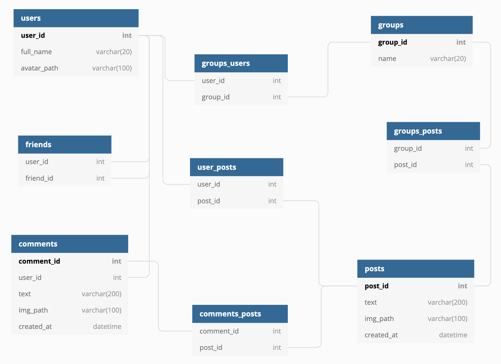

# NewsFeed

## 1. **Выбор темы**
- Аналог новостной ленты социальной сети vk.com - NewsFeed
## 2. **Определение возможного диапазона нагрузок подобного проекта**
Примечание: так как сервис новостной ленты входит в vk.com, то можно считать что количество посещений vk.com в целом равно количеству посещений сервиса новостной ленты. Отличие будет в том, сколько в среднем времени проводится пользователем в новостной ленте относительно всего приложения/других сервисов vk.com
- Дневная аудитория - [43.3% населения России](https://popsters.ru/blog/post/svezhie-dannye-o-vk) - 62 млн пользователей
- Месячная аудитория - [71.8% населения России](https://popsters.ru/blog/post/svezhie-dannye-o-vk) - 104 млн пользователей
- [30 минут в день](https://www.emarketer.com/content/emarketer-reduces-us-time-spent-estimates-for-facebook-and-snapchat) - столько среднестатистический пользователь проводит время в новостной ленте

## 3. **Выбор планируемой нагрузки - 50% доля рынка России**
Самые крупные сервисы:
- Vk.com - 43.3% - 62 млн ежедн.
- Instagram - 26.9% - 39 млн ежедн.
- Ok.ru - 16.9% - 24 млн ежедн. 
Планируемая нагрузка - 49.6% ~ 50% доля рынка в России.

[Источник: Mediascope](https://popsters.ru/blog/post/svezhie-dannye-o-vk)

Новостная лента у всех пользователей очень и очень разная. Посты ленты могут состоять как из текста, так и из музыки и видео. Наш MVP будет состоять только из текста и картинок. Оценивая себя как среднестатистического пользователя, подсчитал сколько пользовательского трафика займет просмотр ленты в vk.com:
Просмотр новостной ленты (xhr + js + css + текст + картинки, типичные мемы) с отключенным автоплеем заняло у меня 1 минуту 20 секунд. При этом на загрузку всего этого контента у меня израсходовалось 9 Мб. Выходит приблизительно 0.1125 Мб/с на одного среднестатистического пользователя = 

### За секунду:
- 62 млн * 0.1125 Мб/с * ((0.5ч / 24 ч) - плотность распределения) = 145 313 Мб/с = 141 Гб/с = 0.142 Тб/с учитывая всех пользователей
- 0.142 Тб/с * 8 = 1.1 Тбит/с

### Посчитаем дневную нагрузку:
0.1125 Мб за секунду * 60 * 60 = 405 Мб за час

- 62 млн * (30 (минут) / 60 (час)) * 405 Мб = 11973 Тб

## 4. **Логическая схема базы данных (без выбора СУБД)**



- users: 1 строка занимает 124 байта 
- group_users: 1 строка занимает 8 байт
- groups: 1 строка занимает 24 байта
- friends: 1 строка занимает 8 байт
- user_posts: 1 строка занимает 8 байт
- group_posts: 1 строка занимает 8 байт
- comments: 1 строка занимает 316 байт
- comments_posts: 1 строка занимает 8 байт
- posts: 1 строка 312 байт

Пусть U - количество друзей, N(Ui) - количество постов i-го пользователя, G - количество групп, на которые подписан пользователь, N(Gj) - количество постов j-го группы. Достать все новости займет:
O(U*N(Ui) + G*N(Gj))

Форфмирование фида для пользователей так же нагружает сервер, будем учитывать это при подсчете нагрузки.

Будем использовать что-то вроде пагинации и показывать пользователю 20 постов на каждой странице.

## 5. **Физическая системы хранения (конкретные СУБД, шардинг, расчет нагрузки, обоснование реализуемости на основе результатов нагрузочного тестирования)**
Рассчитаем среднее RPS для новостной ленты учитывая что пользователи заходят в разное время:


За 33 просмотренных поста, пока я, как среднестатистический пользователь, просматривал ленту, было совершено (XHR + JS + CSS + IMG)  322 реквеста. 
В среднем в 1 блок = 20 постов. Значит за 20 постов в среднем 196 реквестов. Статистика vk.com говорит, что пользователь в среднем просматривает 7 блоков. 
196 * 7 = 1372 реквеста от одного пользователя за день (за те самые полчаса) в новостной ленте. Для расчета: за секунду это было бы около 1 RPS

Грубо оценивая, в секунду получается 4 реквеста (Учитывается не только подгрузка картинок, но и подгрузка топ комментариев под постом + аватарки пользователей на комментариях)
```
62 000 0000 ежедневных пользователей x 1 RPS x ((0.5 ч / 24 ч ) - плотность распределения)
-------------------------------
~ 1 291 666 RPS 
```
1) Для такой нагрузки возьмем 215 серверов с PostgreSQL. В среднем по 6000 RPS на 1. Нам в обязательном порядке понадобится горизонтальное шардирование, т.к. все таблицы огромные, вертикальный шардинг нам мало поможет. Есть несколько основных сущности:
- users - для юзеров шардирование будет по id
- friends - для друзей по так же по id, но будут дубликаты
- posts - с постами дело обстоит сложнее необходимо выбрать такой ключ, по которому формирование топа постов создавало бы наименьшую нагрузку. Как вариант класть топ (например топ-20) постов для каждого пользователя в одну таблицу и сортировать по времени (сверху будут посты с последних публикаций). Тогда шардинг будет по user_id, которому соответствуют эти топ-20 постов. Навесим B-Tree или Hash индексы на user_id для оптимизации поиска. Так же будем использовать репликацию , по одному slave на каждый master сервер = 430 серверов.  Из slave будет происходить чтение, а запись в master. Инсертить новые посты в таблицу с топ-20 постами, то есть редактировать будем в master, соответственно slave будет догонять.


2) 122 поста в день в новостной ленте среднестатистического пользователя это 122 * 7 =  854 постов в неделю в ленте

- Число друзей = 286
- Число групп = 50
- Число друзей + групп = 336

Прирост еженедельный: 854 / 336 = 2.54 на одного юзера или группу

Количество постов: 2.54 * (62млн акт юзеров + 75млн акт групп) * (30 дней * 12 месяцев *  14 лет ) *  0.5 (учитываем кол-во уников в году)  = 876 909.6 млн =   876 910 000 000 = 876.91 млрд постов

Один пост в среднем = 100kb картинка + 500kb комментарии с картинками = 600kb

876.91 млрд * 600 kb = 526 146 kb * 10^9 = 526 146 Тб

Все посты будем хранить в Amazon S3 хранилище, который автоматически шардит данные.

## 6. **Выбор прочих технологий: языки программирования, фреймворки, протоколы взаимодействия, веб-сервера и т.д. (с обоcнованием выбора)**
Клиент: js - распространенность, полная интеграция с HTML+CSS и серверной частью

Бекенд: Golang - эффективное использование вычислительной мощности для многоядерных архитектур - высокая производительность, строгая типизация, широкие возможности стандартной библиотеки языка; быстрая разработка сервиса. Абсолютно точно, понадобятся микросервисы, т.к. это увеличит надежность сервиса целиком, для общения микросервисов будем использовать protobuf, т.к. его сериализация/десериализация почти на порядок быстрее json и других. 

Балансировщик и прокси: nginx - скорость, распространненость и хорошая выдержка на крупных нагруженных проектах, широкие возможности, бесплатный веб-сервер.


## 7. **Расчет нагрузки и потребного оборудования**

### Бекенд:
Из 1 291 666 RPS, приходится ~41 000 RPS на одно лишь формирование ленты на бекенде. 5 микросервисов, 2 из которых на формирование ленты, 2 на формирование запроса к БД и 1 микросервис для работы с таблицей, в которой хранится топ-20 постов(самая нагруженная часть формирования ленты это формирование топ постов для пользователя на 1-2 блоках, так как пользователь обычно просматривает их и выходит). У среднестатистического пользователя такая операция занимает ~250мс, за секунду 16 ядерный сервер в целом может держать 4 000 RPS. Учитывая наши 41 000 RPS нам понадобится ~10 серверов, 5 микросервисов на каждом сервере по 2 копии следующих характеристик:
| CPU(cores) | RAM(GB) | SSD(GB) |
|------------|---------|---------|
|   16       | 16      | 512    |

Возьмем с запасом в 3 раза больше: 30 серверов.

Запрос на формирование ленты выглядит следующим образом:
- Запрос на nginx, тот на основе выбранного алгоритма балансировки выбирает микросервис (условно назовем его первый) для формирования ленты. Перед тем как сформировать ленту либо положить новый пост в БД, запрос попадает на второй или третий микросервис в зависимости от того, запрашиваются ли посты или инсертятся. В случае инсерта, запрос попадает на третий микросервис, который редактирует запись в таблице шардов с условными топ-20 постами для каждого пользователя. В случае запроса - на второй микросервис он пробрасывается запрос на шарды БД, описанные в п.5, далее выбранные посты возвращаются на первый микросервис и отдается на фронтенд.

### БД:
  Из данных в пунктах 4 и 5: 
- 62млн пользователей * 124 байта  = 7688 Мб  = 7.68 Гб (Записи в users обо всех пользователях)
- 75млн групп * 24 байта = 1800 Мб = 1.8 Гб (Записи в groups обо всех группах) 
- 62млн пользователей * 50 (в стольких группах в среднем состоит пользователь) * 8 байт = 24800 Мб = 24.8 Гб (Записи в group_users)
- 62млн пользователей * 286 (столько в среднем друзей у пользователя) *  8 байт  = 141 856 Мб = 141 Гб (Записи во friends)
- 8 байт * 876.91 млрд (кол-во постов)= 7015.28 Гб = 7 Тб (Записи в user_posts + в group_posts) 
- 316 байт * 10 * 876.91 млрд (кол-во постов) = 2 771 035 Гб = 2771 Тб (Записи comments)
- 8 байт * 10 * 876.91 млрд (кол-во постов) = 70152.8 Гб = 70 Тб (Записи в comments_posts)
- 312 байт * 876.91 млрд (кол-во постов) = 273 595.92 Гб = 273 Тб (Записи в posts)

Итог: 273 Тб + 70 Тб + 2771 Тб + 7 Тб + 141 Гб + 25 Гб + 2 Гб + 8 Гб = 3121.176 Тб

Конечно можно вертикально увеличивать накопитель серверов долго, но оптимальным будет взять сервера со следующими характеристиками:

| CPU(cores) | RAM(GB) | SSD(TB) |
|------------|---------|---------|
|   16       | 16      | 20    |

Выходит что наших 215 серверов (не считая slave) недостаточно. Если один сервер имеет память 20 Тб, то нам понадобится 157 серверов, учитывая нагрузку, и запас памяти необходимо взять в 3 раза больше = 471 примерно по 3000 RPS на 1, не считая slaves. Для обеспечения надежности возьмем по 2 реплики на каждый сервер Вместе со slaves получится 1413 сервера.


### Балансировщик + фронтенд:
Согласно этому [Performance](https://www.nginx.com/blog/testing-the-performance-of-nginx-and-nginx-plus-web-servers/) и - [фронтенд](https://habr.com/ru/company/tinkoff/blog/474632/)
- 3 Мб * 62млн (юзеров в день) 186 000 000 Мб / день = 2152 Мб / с, учитывая так же SSL:

Нам достаточно 5 серверов, для надежности возьмем с запасом 15.

| CPU(cores) | RAM(GB) | SSD(GB) |
|------------|---------|---------|
|   32       | 32      | 512    |


 ## 8. **Выбор хостинга / облачного провайдера и расположения серверов**
 
Облачное хранилище имеет ряд преимуществ - хороший уровень доступности, быстрая настройка, безопасность и практически бесконечное масшитабирование, Как уже было сказано в п.5 выберем Amazon Web Services и будем использовать S3 
* [Инфраструктура AWS](https://aws.amazon.com/ru/about-aws/global-infrastructure/)

Пользователи сервиса - русскоязычные поэтому возьмем наиболее близкие возможные расположения. Для равномерного распределения по ДЦ поделим общее количество серверов на 4 и на каждом ДЦ поставим по ~ 3 сервера с фронтендом, 10 серверов с бекендом, 353 сервера с БД и по 3 сервера с балансировщиком.  
- Европа (Стокгольм)
- Китай (Пекин)
- Франция (Париж)
- Милан

В случае отказа одного из дата центра, весь наш сервис не упадет, тк поставили сервера на разных зонах.

## 9. **Схема балансировки нагрузки (входящего трафика и внутрипроектного, терминация SSL)**
Для балансировки нагрузки будем использовать nginx схемы L7 встроенными настройками SSL терминации. Для балансировки нагрузки на сервера nginx используется L4 с общим виртуальным ip.
Балансировка нагрузки по классическому Round Robin алгоритму - нет зависимости от времени пакета, более менее равномерное распределение ресурсов. 
## 10. **Обеспечение отказоустойчивости**
Для обеспечения отказоустойчивости как уже было сказано в п.5 на каждый master будет slave. Таким образом чтение идет со slave, а запись в master. Так как между данными в master и в slave может быть задержка, в последовательных операциях чтения данные будут идти с master. Если один из master или slave ломается, переключаем работу со slave на master и наоборот, настраивая новую репликацию.

Сервера AWS из разных зон (на случай падения какого-либо датацентра)

Микросервисная архитектура на бекендах, таким образом не будет единой точки отказа.

Сбор метрик и автоматический перезапуск серверов в случае отказа. Для предсказания деградации приложения на каком-либо сервере или приложения в целом будем собирать метрики, отдавать метрики по /metrics с помощью prometheus и отрисовывать графики пользуясь graphana.


